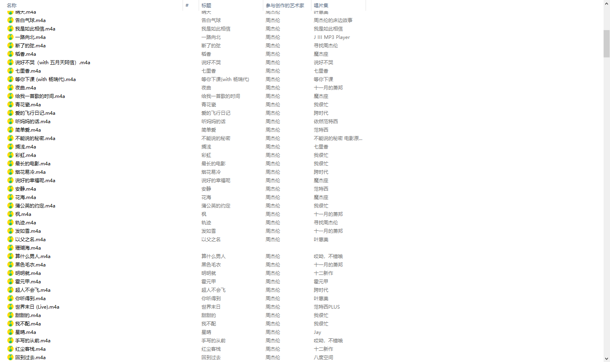

# QQ音乐爬虫(with scrapy)/QQ Music Spider

## UPDATE 2019.12.23
已实现对QQ音乐文件的下载，出于版权考虑，不对此部分代码进行公开。**此项目仅作为学习交流使用，支持正版，人人有责**



## 项目介绍
- 在写一个项目的时候需要用到一些音乐的信息，但是在网上找了许久也没找到满意的音乐语料，于是便用scrapy写了一个QQ音乐的爬虫
- 由于本人只需要用到中文歌曲，所以仅使用该爬虫爬取了QQ音乐中排名前6400名的内地和港台歌手的49万+的歌曲信息，该资源也分享到了百度云(**该资源仅用于学习交流，请勿用于商业用途，如有侵权，请联系删除**)
- QQ音乐的歌曲信息是使用js动态填充的，虽然QQ音乐的歌手和歌曲信息是使用GET进行明文请求，但是开发人员却在url请求参数上添加了一些冗余信息，对参数进行了一些加密，因此大部分精力还是花在了解析url上

## 运行环境
scrapy==1.5.1

## 使用方法
进入项目根目录,运行如下命令即可：scrapy crawl qqmusic

## 歌曲格式
爬取到的歌曲信息保存在根目录下的music文件中，每一行表示一条歌曲，存储格式为json

歌曲的字段说明：
- singer_name：歌手名称，数组形式，因为一首歌可能由多名歌手合唱
- song_name：歌曲名称
- subtitle：歌曲的子标题
- album_name：专辑名称
- singer_id：歌手id，数组形式
- singer_mid：歌手的mid，数组形式
- song_time_public：歌曲发行时间
- song_type：歌曲类型
- language：歌曲语种
- song_id：歌曲id
- song_mid：歌曲mid
- song_url：歌曲播放的url
- lyric：歌词
- hot_comments：歌曲的精彩评论(此处只爬取了歌曲的精彩评论，部分比较冷门的歌曲有最新评论，但是没有精彩评论)，数组形式。若无精彩评论，置为"null"
  -   comment_name：评论者的昵称
  -   comment_text：评论内容

 爬取[说好不哭（with 五月天阿信）](https://y.qq.com/n/yqq/song/001qvvgF38HVc4.html)样例：
```
{
	'singer_name': ['周杰伦'],
	'song_name': '说好不哭（with 五月天阿信）',
	'subtitle': '',
	'album_name': '说好不哭（with 五月天阿信）',
	'singer_id': [4558],
	'singer_mid': ['0025NhlN2yWrP4'],
	'song_time_public': '2019-09-16',
	'song_type': 0,
	'language': 0,
	'song_id': 237773700,
	'song_mid': '001qvvgF38HVc4',
	'song_url': 'https://y.qq.com/n/yqq/song/001qvvgF38HVc4.html',
	'hot_comments': [{
		'comment_name': 'Cohen',
		'comment_text': '《说好不哭》是听众很期待的一个作品，前奏钢琴曲的渐入和后续的弦乐给整首歌奠定了温暖的基调。不知道大家有没有好好去看了这首歌的背景介绍“这是一首关于「约定」和「成全」的情歌，整首歌以钢琴为主要故事线，弦乐编织出抒情场景，营造出一种爱情电影的氛围”。依然的周式情歌，杰伦最总拿捏住每一首歌的感情基调，总能用最精妙的词曲和编曲打动他的听众。\\n\\n这首歌当然在合乎听众期待的同时，也给予了我们些许特别，第二段阿信的加入相信会令不少听众感到惊喜。对于我来说，我最喜欢整首歌的钢琴曲，温暖纯净感动，或许初遍听并非能完全理解杰伦想要告诉我们怎样的一个爱情故事，但是我们也能从简单的歌词和干净的旋律里感受到情感的部分。'
	}, {
		'comment_name': '野渡无人',
		'comment_text': '“我坚持我的音乐，我喜欢我的音乐，谁叫我是周杰伦。”或许喜欢他，正是因为他对音乐独有的专注认真，才令人对这个音乐才子着迷。\\n我相信很多人的青春里都有他，从曾经除了才华一无所有，无人知晓的少年，到如今的现代流行天王，周杰伦用一首首歌陪伴了我们整个青春，说生如逆旅，多少迷茫和气馁，却总能在他的歌声里找回自己。今岁不复去岁，人生这条人行道上，兜兜转转，还是一个周杰伦。\\n而这首《说好不哭》更像是一个约定，“你会微笑放手 说好不哭让我走” ，而我们不远万里赴约，这就是周杰伦，即青春。\\n'
	}, {
		'comment_name': '是硬糖啊',
		'comment_text': '对于很多80后90后来说，青春或许就这样悄然慢慢过去了，我依稀还记得那个夏天里七里香的香味，还有那个唱着《简单爱》，表情酷酷的男孩。\\n静静听了一遍，还是那个熟悉的风格，那个熟悉的Jay。也许杰伦的嗓音已经有了变化，但是在歌里他依旧延续着那份感动。\\n喜欢Jay的歌，忘不了有多少个夜晚的歌单循环，忘不了有多少次的辗转反侧。他的歌曲，经常会在某个时间点引发你的共鸣。\\n说好不哭，可是有多少人还是会泪流满面，可能是因为40岁的杰伦终于发了新歌，也可能是因为有些过往，有些感动，真的再也回不去了……'
	}, {
		'comment_name': '墨染栀',
		'comment_text': 'Jay式情歌重磅回归，期待了已久的歌。方文山再次作词走心之作，前奏已沉醉。最惊喜的是阿信献声。一个弹琴一个弹吉他，简直是神仙合作。1分40秒左右旋律是五月天的“突然好想你，你会在哪里？”。1分47秒的旋律是《说好的幸福呢》，然后进入阿信的part。杰伦歌里总能藏着这些细腻。我们的青春圆满了。缓缓的钢琴声诉说着凄美的爱情。有一种爱叫默默奉献，无需言语。有一种爱叫放手，你过得幸福就好。距上一次发新歌时隔一年了，40岁的周董是多少人的青春年华，熟悉的旋律是不是依旧耳边回荡。从第一张个人专辑《Jay》到如今，我们热情不减，周董惊喜不断。周杰伦——一个代表时代歌手拥有的魅力。说好不哭，你哭了吗？'
	}, {
		'comment_name': '森岛帆高',
		'comment_text': '初中时的哥哥买的一盒盒堆积成山周杰伦封面的磁带。\\n磁带放入收音机，磁带转动起，每一个停顿瞬间，每一首风格独特，每一句声声入耳。从懵懂到成熟，都是喜欢周杰伦的年轮。\\n在这磁带转动的年轮里，歌曲播放的列表里，生活情绪的喜悲里，一尘不变的还是周杰伦的歌。\\n他的歌包揽了我的一整个年少，度过了我的大半个学生时代，陪伴了我的无数个孤独夜晚。\\n百听不厌可能是对他的歌最完美的诠释吧。\\n周杰伦是我的信念，是我的力量。\\n如今哥哥也已经参加工作，我的学生时代也转瞬即逝。\\n对周杰伦的喜欢怕是听着他音乐的旋律融到了心里，伴随而去了吧。'
	}, {
		'comment_name': '玫瑰少年',
		'comment_text': '今年，杰伦40岁了，但我脑海中却还是那个充满个性，说着“可不可以多唱歌少讲话”的男孩子....《说好不哭》其实可能也是杰伦的心里话，可能以后出歌不会像以前那样快了，也在担心自己歌曲是否还能符合粉丝的要求,但说好不哭哦。\\n我相信对于很多粉丝来说，杰伦已经给予了一个完整的音乐海洋，无论伤心快乐，他好像总有为你匹配的歌曲，时时刻刻呵护着自己的情感，即使在各类歌曲百花齐放的今天，每一个夜晚依旧喜欢在他的歌声中入睡。\\n不会哭的，无论过去还是未来，我们还是愿意让你的歌声陪伴着我们，陪伴着整个青春，陪伴一辈子。'
	}, {
		'comment_name': '蜗牛..',
		'comment_text': '我想，你的青春里一定有一首歌是属于Jay的吧。躺在心里，偶而翻出，正好遇上那个情绪，便产生某些新的情感和新的认知。一场青春，一首周杰伦，沮丧时听听，不论是温柔的还是奋进的，总能唱到元气满满。好的音乐，是会说话的。\n仿佛每次在挣扎，迷茫和无助的时候，都能在他的音乐世界里慢慢治愈，而音乐和周杰伦本就是一次相互成全的相遇。\n青春难以留住，夏天已然散场。人生的道路也许各不相同，但只要在他需要我们的时候为他加油喝彩，就足够了，那才叫青春。\n不管什么时候，什么地点，我希望所有歌迷回过头来看到的还是同一个周杰伦。'
	}, {
		'comment_name': '此用户已被封',
		'comment_text': '周杰伦三个字是一代青春，还记得08年晚会上听的那首《青花瓷》顿时茅塞顿开，世间静会有如此好听的歌曲。之后迷上他的所有歌曲，自己买磁带上学的时候在宿舍晚上听，陪我渡过了5年学习生涯。这次我们的周青春出新歌，前些天一直在等待，熬夜等待但我觉得这些所有的等待都是值得的。'
	}, {
		'comment_name': '黄子韬TAO',
		'comment_text': '人气top周杰伦❗💎💖✨🌈\\n实力歌手周杰伦❗💎💖✨🌈\\n音乐鬼才周杰伦❗💎💖✨🌈\\n亚洲天王周杰伦❗💎💖✨🌈\\n家庭美满周杰伦❗💎💖✨🌈\\n魔术大师周杰伦❗️💎💖✨🌈\\n华语天王周杰伦❗️💎💖✨🌈\\n无与伦比周杰伦❗️💎💖✨🌈\\n奶茶仙子周杰伦❗️💎💖✨🌈\\n守护全世界最好的周杰伦💖💖💖'
	}, {
		'comment_name': '指法芬芳张大仙z',
		'comment_text': '曾经傲娇的少年，\\n也已到了不惑之年，\\n从一个总是喜欢将脸庞隐藏在鸭舌帽下的腼腆男孩，\\n到如今撒娇卖萌幽默语句频出还时时撒狗粮的小公举，\\n新专辑如约而至，\\n能在这个时代遇到杰伦哥是人生最大幸运，\\n他的作品照亮你的路，陪伴你度过漫长的深夜，\\n你的支持和包容，也让他从默默无闻变成万众瞩目，\\n也许有一天 你忙于生活 他归于沉寂 渐渐不再会有交集\xa0，\\n希望在慢慢老去 还能回忆起青春时 曾为一个人疯狂追逐过，\\n他的名字就是\\n周！杰！伦！一生所爱 JAY\\n感谢你的音乐\\n让我有了一直学习吉他的动力，\\n感谢你的音乐\\n陪我度过的每一个夜晚，\\n感谢你的音乐\\n陪伴我在篮球场上的每一天，\\n青春有你，如此甚好，JAY ！'
	}, {
		'comment_name': '指法芬芳张大仙z',
		'comment_text': '40岁的杰伦就坐在那里，\\n深情的目光望过去，\\n满眼都是自己当年22岁横空出世范特西少年身影......\\n作为华语乐坛最成功最具有影响力的歌手音乐人，\\n15座金曲奖、八届大中华区销量冠军、4届世界音乐奖WMA、全球25大创意人物、《Fast Company》全球百大创意人物，2010年歌曲下载量世界第三，历史上第一首好莱坞中文主题曲，亚洲天王，世界十大鬼才音乐人之一，\\n这就是周杰伦，是信仰，是天才，是一个时代，是传奇，是华人之光，是80后的回忆，90后的青春，他还见证着00后的成长；\\n感谢我伦，\\n你走过的轨迹是青春的记忆，\\n致敬，周杰伦！\\n永远的小公举，永远的热爱！'
	}, {
		'comment_name': '指法芬芳张大仙z',
		'comment_text': '难以忘记初次遇见你，是在《红尘客栈》的《大笨钟》下，你笑得《甜甜的》像是天边的一道《彩虹》色的《麦芽糖》；他们都说爱情来的太快像是《龙卷风》，你和我《一点点》靠近，相识，相恋；我经常会《安静》的看着你《傻笑》，表白《说好不哭》陪你到永远；在每个《晴天》里，我都会在学校的篮球场上《等你下课》；我的女孩，你就像是我《不能说的秘密》，我想给你《告白气球》般的浪漫，我想和你许下《蒲公英的约定》，然后牵起你的手，用吉他弹起那《手写的从前》，就这样一直牵着你去看《最长的电影》，在每个夜晚里去看最美的《星晴》，直到永远；我的女孩，你就像是海里的《美人鱼》公主，我愿做你的王子，一直爱你❤一直守护在你身边。😘'
	}, {
		'comment_name': '黄子韬TAO',
		'comment_text': '手牵手，一步两步三步四步望着天\\n看星星，一颗两颗三颗四颗连成线\\n周杰伦“说”三部曲将会在2019年9月16日正式完结\\n千万别错过，这一错就是一辈子！'
	}, {
		'comment_name': '\u2062',
		'comment_text': '周杰伦\\n我QQ音乐里唯一的主角\\n你说要听妈妈的话喝爷爷泡的茶\\n你说最美的是与你躲过雨的屋檐下\\n我提一笔想用几行字形容你是我的谁\\n礼物用香榭的落叶就不会觉得有点难追\\n时间是解药也是我现在服下的这一剂毒药\\n我的十八年青春因为有你的出现而引以为傲\\n只要你还在为我们唱还在带着笑面对逆境环绕\\n风就不会把距离吹得好远我的青春也不会老\\n有人说你江郎才尽才华不复当年模样\\n那是他们嫉妒你绝世的巅峰和辉煌\\n今晚说好不哭\\n谢谢你在一直陪伴着我的青春\\n❤️❤️❤️'
	}, {
		'comment_name': '指法芬芳张大仙z',
		'comment_text': '青春不散！东方之殿开轩窗，绘梦之卷迷迭香，献世青花瓷世无双，情书却渐黄，手书兰亭序，孤饮女儿红，乱舞春秋夜未央，园游会下灿烂七里香，遥思娘子在西厢，抚断了的弦，奏夜的第七章，同一种调调徒感伤。枫叶落光，花海安静夜曲入乡，忍者星晴夜望，摩羯座非寻常，梯田闻稻香，甜甜的心雨洒晴天，将军屋顶发呆，懦夫将被淘汰，我不配周大侠龙战骑士那神态，没借口不退后，以父之名远走，拜别霍元甲，身披黄金甲，持双截棍耍帅，一路向北过千山万水漂移而来，赴千里之外菊花台， 龙卷风兼蓝色风暴雨，四面楚歌响起，止战之殇的记忆、逆鳞的轨迹，乘坐时光机，世界末日又回到过去，简单爱在爱的飞行日记里一直搁浅下去。'
	}],
	'lyric': '说好不哭（with 五月天阿信） - 周杰伦 (Jay Chou)\\n词：方文山\\n曲：周杰伦\\n周杰伦：\\n没有了联络 后来的生活\\n我都是听别人说\\n说你怎么了 说你怎么过\\n放不下的人是我\\n人多的时候 就待在角落\\n就怕别人问起我\\n你们怎么了 你低着头\\n护着我连抱怨都没有\\n电话开始躲 从不对我说\\n不习惯一个人生活\\n离开我以后 要我好好过\\n怕打扰想自由的我\\n都这个时候 你还在意着\\n别人是怎么怎么看我的\\n拼命解释着 不是我的错 是你要走\\n眼看着你难过 挽留的话却没有说\\n你会微笑放手 说好不哭让我走\\n阿信：\\n电话开始躲 从不对我说\\n不习惯一个人生活\\n离开我以后 要我好好过\\n怕打扰想自由的我\\n都这个时候 你还在意着\\n别人是怎么怎么看我的\\n拼命解释着 不是我的错 是你要走\\n合：\\n眼看着你难过 挽留的话却没有说\\n你会微笑放手 说好不哭让我走\\n周杰伦：\\n你什么都没有 却还为我的梦加油\\n阿信：\\n心疼过了多久\\n周杰伦：\\n过了多久\\n合：\\n还在找理由等我'
}
```

## 爬虫的大致逻辑
- 先爬取指定数量的歌手
- 根据歌手的id，获取每一位歌手的歌曲列表(歌曲列表中包含歌曲的一些信息，但不包括歌词和评论信息)
- 根据歌曲id，获取歌曲的歌词信息
- 根据歌曲id，获取歌曲的评论信息
- 将歌曲写入文件

## 语料分享
**该资源仅用于学习交流，请勿用于商业用途，如有侵权，请联系删除。**

|语料名称 | 语料地址 |语料描述|
|---------|--------|--------|
|49万+的歌曲信息|[百度网盘【提取码：uokb】](https://pan.baidu.com/s/1LSQoL5jklOw7B9DzkyCwGw)|包含QQ音乐中排名前6400名的内地和港台歌手的49万+的歌曲信息，包含歌曲信息、歌词、精彩评论等|


## 解析QQ音乐的url
QQ音乐的歌手和歌曲信息，都是使用js进行动态填充的，所以不可能通过爬取html网页，然后解析网页内容来获取歌曲信息。既然是通过js进行动态填充，那就需要对请求的url的格式进行解析

### 歌手列表url解析
打开QQ音乐的 [歌手页面](https://y.qq.com/portal/singer_list.html) ，用开发者工具查看，找到请求歌手列表的url如下：
```
https://u.y.qq.com/cgi-bin/musicu.fcg?-=getUCGI9574303950614538&g_tk=5381&loginUin=0&hostUin=0&format=json&inCharset=utf8&outCharset=utf-8&notice=0&platform=yqq.json&needNewCode=0&data=%7B%22comm%22%3A%7B%22ct%22%3A24%2C%22cv%22%3A0%7D%2C%22singerList%22%3A%7B%22module%22%3A%22Music.SingerListServer%22%2C%22method%22%3A%22get_singer_list%22%2C%22param%22%3A%7B%22area%22%3A-100%2C%22sex%22%3A-100%2C%22genre%22%3A-100%2C%22index%22%3A-100%2C%22sin%22%3A0%2C%22cur_page%22%3A1%7D%7D%7D
```
可以看到url中携带了很多参数，包括：g_tk、loginUin、hostUin、format、inCharset、outCharset、notice、platform、needNewCode、data

将该url放到postman中，尝试一个接一个地取消参数，找到有用的参数。最终可以知道，其实只有data这个参数对请求有实际的作用，把其他参数去掉，得到简化后的url如下：
```
https://u.y.qq.com/cgi-bin/musicu.fcg?data=%7B%22comm%22%3A%7B%22ct%22%3A24%2C%22cv%22%3A0%7D%2C%22singerList%22%3A%7B%22module%22%3A%22Music.SingerListServer%22%2C%22method%22%3A%22get_singer_list%22%2C%22param%22%3A%7B%22area%22%3A-100%2C%22sex%22%3A-100%2C%22genre%22%3A-100%2C%22index%22%3A-100%2C%22sin%22%3A0%2C%22cur_page%22%3A1%7D%7D%7D
```
结合歌手页面，仔细分析一下上述简化后的url，会发现data参数中隐含地携带了很多实际的请求参数：
- area：歌手的地域(内地、港台、欧美等)。-100:全部、200:内地、2:港台、5:欧美、4:日本、3:韩国、6:其他
- genre：歌手风格(流行、嘻哈等)。-100：全部、1：流行、6：嘻哈、2：摇滚、4：电子、3：民谣、8：R&B、10：民歌、9：轻音乐、5：爵士、14：古典、25：乡村、20：蓝调
- cur_page：当前歌手列表的页码
- index：cur_page*page_size(index表示当前页的起始index，page_size表示每一页歌手的数量)


使用控制变量法，固定area和genre变量，比较下列请求第一、二、三页歌手的url，可以发现其中index和cur_page中存在一些潜在规律

在下列三个url中(*是人为添加的，方便描述)，index后面跟着的用**标记的数字就是变量index，cur_page后面用
**标记的数字就是变量cur_page。在[歌手页面](https://y.qq.com/portal/singer_list.html)，可以看到每一页有80个歌手。很显然，当要请求第n页歌手的时候，cur_page=n，index=80(n-1)。
```
https://u.y.qq.com/cgi-bin/musicu.fcg?data=%7B%22comm%22%3A%7B%22ct%22%3A24%2C%22cv%22%3A0%7D%2C%22singerList%22%3A%7B%22module%22%3A%22Music.SingerListServer%22%2C%22method%22%3A%22get_singer_list%22%2C%22param%22%3A%7B%22area%22%3A-100%2C%22sex%22%3A-100%2C%22genre%22%3A-100%2C%22index%22%3A-100%2C%22sin%22%3A**0**%2C%22cur_page%22%3A**1**%7D%7D%7D

https://u.y.qq.com/cgi-bin/musicu.fcg?data=%7B%22comm%22%3A%7B%22ct%22%3A24%2C%22cv%22%3A0%7D%2C%22singerList%22%3A%7B%22module%22%3A%22Music.SingerListServer%22%2C%22method%22%3A%22get_singer_list%22%2C%22param%22%3A%7B%22area%22%3A-100%2C%22sex%22%3A-100%2C%22genre%22%3A-100%2C%22index%22%3A-100%2C%22sin%22%3A**80**%2C%22cur_page%22%3A**2**%7D%7D%7D

https://u.y.qq.com/cgi-bin/musicu.fcg?data=%7B%22comm%22%3A%7B%22ct%22%3A24%2C%22cv%22%3A0%7D%2C%22singerList%22%3A%7B%22module%22%3A%22Music.SingerListServer%22%2C%22method%22%3A%22get_singer_list%22%2C%22param%22%3A%7B%22area%22%3A-100%2C%22sex%22%3A-100%2C%22genre%22%3A-100%2C%22index%22%3A-100%2C%22sin%22%3A**160**%2C%22cur_page%22%3A**3**%7D%7D%7D
```
通过以上分析，可以得到请求歌手列表的url格式如下：
```
singer_list_url = "https://u.y.qq.com/cgi-bin/musicu.fcg?data=%7B%22comm%22%3A%7B%22ct%22%3A24%2C%22cv%22%3A0%7D%2C%22singerList%22%3A%7B%22module%22%3A%22Music.SingerListServer%22%2C%22method%22%3A%22get_singer_list%22%2C%22param%22%3A%7B%22area%22%3A{area}%2C%22sex%22%3A-100%2C%22genre%22%3A{genre}%2C%22index%22%3A-100%2C%22sin%22%3A{index}%2C%22cur_page%22%3A{cur_page}%7D%7D%7D"
```

### 歌曲列表url解析
同理找到请求歌曲列表的url
```
https://u.y.qq.com/cgi-bin/musicu.fcg?-=getSingerSong8235365887193979&g_tk=5381&loginUin=0&hostUin=0&format=json&inCharset=utf8&outCharset=utf-8&notice=0&platform=yqq.json&needNewCode=0&data=%7B%22comm%22%3A%7B%22ct%22%3A24%2C%22cv%22%3A0%7D%2C%22singerSongList%22%3A%7B%22method%22%3A%22GetSingerSongList%22%2C%22param%22%3A%7B%22order%22%3A1%2C%22singerMid%22%3A%22004Be55m1SJaLk%22%2C%22begin%22%3A0%2C%22num%22%3A10%7D%2C%22module%22%3A%22musichall.song_list_server%22%7D%7D
```
过滤掉无用的参数，得到简化后的url：
```
https://u.y.qq.com/cgi-bin/musicu.fcg?data=%7B%22comm%22%3A%7B%22ct%22%3A24%2C%22cv%22%3A0%7D%2C%22singerSongList%22%3A%7B%22method%22%3A%22GetSingerSongList%22%2C%22param%22%3A%7B%22order%22%3A1%2C%22singerMid%22%3A%22004Be55m1SJaLk%22%2C%22begin%22%3A0%2C%22num%22%3A10%7D%2C%22module%22%3A%22musichall.song_list_server%22%7D%7D
```
data中隐藏的参数：
- singerMid：歌手的mid
- num：相当于page_size，表示每一页歌曲的数量
- begin：page*page_size(begin表示当前页的起始index)

通过以上分析，可以得到请求歌曲列表的url格式如下：
```
song_list_url = "https://u.y.qq.com/cgi-bin/musicu.fcg?data=%7B%22comm%22%3A%7B%22ct%22%3A24%2C%22cv%22%3A0%7D%2C%22singerSongList%22%3A%7B%22method%22%3A%22GetSingerSongList%22%2C%22param%22%3A%7B%22order%22%3A1%2C%22singerMid%22%3A%22{singer_mid}%22%2C%22begin%22%3A{begin}%2C%22num%22%3A{num}%7D%2C%22module%22%3A%22musichall.song_list_server%22%7D%7D"
```

### 请求歌词url解析
通过请求歌曲列表的url发现，并没有返回歌曲的歌词信息，因此肯定是通过额外的url请求获得歌词，找到请求歌词的url如下：
```
https://c.y.qq.com/lyric/fcgi-bin/fcg_query_lyric_yqq.fcg?nobase64=1&musicid=105648715&-=jsonp1&g_tk=5381&loginUin=0&hostUin=0&format=json&inCharset=utf8&outCharset=utf-8&notice=0&platform=yqq.json&needNewCode=0
```
将以上url放到postman中发送请求，却得不到正确的回复，经过一番研究，发现该url需要加上referer这个header才可以正常运行
```
referer:https://y.qq.com/n/yqq/song/004RDW5Q2ol2jj.html
```
请求歌词的url经过简化参数后得到：
```
https://c.y.qq.com/lyric/fcgi-bin/fcg_query_lyric_yqq.fcg?musicid=105648715&format=json
```
容易看出
- musicid：song_id
- referer中的"004RDW5Q2ol2jj"表示song_mid

最终得到请求歌词的url如下，lyric_url需要带上referer这个header：
```
lyric_url = "https://c.y.qq.com/lyric/fcgi-bin/fcg_query_lyric_yqq.fcg?nobase64=1&musicid={song_id}&format=json"

referer = "https://y.qq.com/n/yqq/song/{song_mid}.html"
```
### 歌曲评论url解析
找到歌曲评论的url如下：
```
https://c.y.qq.com/base/fcgi-bin/fcg_global_comment_h5.fcg?g_tk=5381&loginUin=0&hostUin=0&format=json&inCharset=utf8&outCharset=GB2312&notice=0&platform=yqq.json&needNewCode=0&cid=205360772&reqtype=2&biztype=1&topid=105648715&cmd=8&needmusiccrit=0&pagenum=0&pagesize=25&lasthotcommentid=&domain=qq.com&ct=24&cv=10101010
```

经过参数简化后，得到如下url：
```
https://c.y.qq.com/base/fcgi-bin/fcg_global_comment_h5.fcg?biztype=1&topid=105648715&cmd=8&pagenum=0&pagesize=25
```
参数说明：
- topid：歌曲的song_id
- pagenum："最新评论"的页数
- pagesize：每页"最新评论"的评论数量

注意：此处的pagenum和pagesize影响的是"最新评论"的返回结果，而不影响"精彩评论"，该url中没有参数可以控制"精彩评论"的返回结果

请求歌曲评论的url格式如下：
```
comment_url = 'https://c.y.qq.com/base/fcgi-bin/fcg_global_comment_h5.fcg?biztype=1&topid={song_id}&cmd=8&pagenum={pagenum}&pagesize={pagesize}'
```

### 歌曲url
歌曲的url格式如下：
```
https://y.qq.com/n/yqq/song/{song_mid}.html
```
## 歌词解析
以周杰伦的[说好不哭（with 五月天阿信）](https://y.qq.com/n/yqq/song/001qvvgF38HVc4.html)为例

通过lyric_url请求获得的歌词格式如下，格式看起来还是比较杂乱的，包含各种字符
```
[ti&#58;说好不哭（With&#32;五月天阿信）]&#10;[ar&#58;周杰伦]&#10;[al&#58;说好不哭（With&#32;五月天阿信）]&#10;
[by&#58;]&#10;[offset&#58;0]&#10;[00&#58;00&#46;00]说好不哭（with&#32;五月天阿信）&#32;&#45;&#32;周杰伦&#32;&#40;Jay&#32;Chou&#41;&#10;
[00&#58;14&#46;94]词：方文山&#10;[00&#58;19&#46;09]曲：周杰伦&#10;[00&#58;23&#46;24]周杰伦：&#10;
[00&#58;26&#46;51]没有了联络&#32;后来的生活&#10;[00&#58;29&#46;76]我都是听别人说&#10;[00&#58;32&#46;85]说你怎么了&#32;说你怎么过&#10;
[00&#58;36&#46;02]放不下的人是我&#10;[00&#58;39&#46;20]人多的时候&#32;就待在角落&#10;[00&#58;42&#46;34]就怕别人问起我&#10;
[00&#58;45&#46;37]你们怎么了&#32;你低着头&#10;[00&#58;48&#46;30]护着我连抱怨都没有&#10;[00&#58;51&#46;82]电话开始躲&#32;从不对我说&#10;
[00&#58;54&#46;98]不习惯一个人生活&#10;[00&#58;58&#46;11]离开我以后&#32;要我好好过&#10;[01&#58;01&#46;32]怕打扰想自由的我&#10;
[01&#58;04&#46;39]都这个时候&#32;你还在意着&#10;[01&#58;07&#46;56]别人是怎么怎么看我的&#10;[01&#58;10&#46;77]拼命解释着&#32;不是我的错&#32;是你要走&#10;
[01&#58;15&#46;55]眼看着你难过&#32;挽留的话却没有说&#10;[01&#58;28&#46;14]你会微笑放手&#32;说好不哭让我走&#10;[01&#58;52&#46;13]阿信：&#10;
[01&#58;54&#46;95]电话开始躲&#32;从不对我说&#10;[01&#58;58&#46;17]不习惯一个人生活&#10;[02&#58;01&#46;26]离开我以后&#32;要我好好过&#10;
[02&#58;04&#46;41]怕打扰想自由的我&#10;[02&#58;07&#46;62]都这个时候&#32;你还在意着&#10;[02&#58;10&#46;62]别人是怎么怎么看我的&#10;
[02&#58;13&#46;90]拼命解释着&#32;不是我的错&#32;是你要走&#10;[02&#58;18&#46;51]合：&#10;[02&#58;18&#46;71]眼看着你难过&#32;挽留的话却没有说&#10;
[02&#58;31&#46;28]你会微笑放手&#32;说好不哭让我走&#10;[02&#58;50&#46;54]周杰伦：&#10;[02&#58;53&#46;38]你什么都没有&#32;却还为我的梦加油&#10;
[03&#58;04&#46;99]阿信：&#10;[03&#58;05&#46;92]心疼过了多久&#10;[03&#58;09&#46;83]周杰伦：&#10;[03&#58;10&#46;02]过了多久&#10;
[03&#58;12&#46;58]合：&#10;[03&#58;12&#46;77]还在找理由等我
```
通过正则表达式得到比较工整的歌词(每句歌词之间用\\\\n间隔开)：
```
说好不哭（with 五月天阿信） - 周杰伦 (Jay Chou)\\n
词：方文山\\n
曲：周杰伦\\n
周杰伦：\\n
没有了联络 后来的生活\\n
我都是听别人说\\n
说你怎么了 说你怎么过\\n
放不下的人是我\\n
人多的时候 就待在角落\\n
就怕别人问起我\\n
你们怎么了 你低着头\\n
护着我连抱怨都没有\\n
电话开始躲 从不对我说\\n
不习惯一个人生活\\n
离开我以后 要我好好过\\n
怕打扰想自由的我\\n
都这个时候 你还在意着\\n
别人是怎么怎么看我的\\n
拼命解释着 不是我的错 是你要走\\n
眼看着你难过 挽留的话却没有说\\n
你会微笑放手 说好不哭让我走\\n
阿信：\\n
电话开始躲 从不对我说\\n
不习惯一个人生活\\n
离开我以后 要我好好过\\n
怕打扰想自由的我\\n
都这个时候 你还在意着\\n
别人是怎么怎么看我的\\n
拼命解释着 不是我的错 是你要走\\n
合：\\n
眼看着你难过 挽留的话却没有说\\n
你会微笑放手 说好不哭让我走\\n
周杰伦：\\n
你什么都没有 却还为我的梦加油\\n
阿信：\\n
心疼过了多久\\n
周杰伦：\\n
过了多久\\n
合：\\n
还在找理由等我
```

## settings.py的参数说明
- DOWNLOAD_DELAY：每个request请求的间隔时间
- ROBOTSTXT_OBEY：是否遵守网站的爬虫协议
- SINGER_PAGE_NUM：爬取的歌手页数
- SINGER_PAGE_SIZE：每页歌手的数量
- SONG_PAGE_NUM：每个歌手的歌曲爬取的页数
- SONG_PAGE_SIZE：每个歌手每页歌曲的数量

## 避免爬虫被ban
- 使用user agent池，轮流选择其中一个作为user agent
- 设置下载延迟DOWNLOAD_DELAY,设为1或者更大。（一开始怕QQ音乐官方会有一些反爬虫的检测，于是把DOWNLOAD_DELAY设为1，也就是每隔一秒钟才发送一次请求，发觉爬取速度过于慢，又改成了0.1。最终索性设为0，发现原来QQ音乐对于歌词信息的url并没有反爬虫措施）
- 使用IP池，动态变更IP地址

user agent池如下：
```
"Mozilla/5.0 (Windows NT 6.1; WOW64) AppleWebKit/537.1 (KHTML, like Gecko) Chrome/22.0.1207.1 Safari/537.1",
"Mozilla/5.0 (X11; CrOS i686 2268.111.0) AppleWebKit/536.11 (KHTML, like Gecko) Chrome/20.0.1132.57 Safari/536.11",
"Mozilla/5.0 (Windows NT 6.1; WOW64) AppleWebKit/536.6 (KHTML, like Gecko) Chrome/20.0.1092.0 Safari/536.6",
"Mozilla/5.0 (Windows NT 6.2) AppleWebKit/536.6 (KHTML, like Gecko) Chrome/20.0.1090.0 Safari/536.6",
"Mozilla/5.0 (Windows NT 6.2; WOW64) AppleWebKit/537.1 (KHTML, like Gecko) Chrome/19.77.34.5 Safari/537.1",
"Mozilla/5.0 (X11; Linux x86_64) AppleWebKit/536.5 (KHTML, like Gecko) Chrome/19.0.1084.9 Safari/536.5",
"Mozilla/5.0 (Windows NT 6.0) AppleWebKit/536.5 (KHTML, like Gecko) Chrome/19.0.1084.36 Safari/536.5",
"Mozilla/5.0 (Windows NT 6.1; WOW64) AppleWebKit/536.3 (KHTML, like Gecko) Chrome/19.0.1063.0 Safari/536.3",
"Mozilla/5.0 (Windows NT 5.1) AppleWebKit/536.3 (KHTML, like Gecko) Chrome/19.0.1063.0 Safari/536.3",
"Mozilla/5.0 (Macintosh; Intel Mac OS X 10_8_0) AppleWebKit/536.3 (KHTML, like Gecko) Chrome/19.0.1063.0 Safari/536.3",
"Mozilla/5.0 (Windows NT 6.2) AppleWebKit/536.3 (KHTML, like Gecko) Chrome/19.0.1062.0 Safari/536.3",
"Mozilla/5.0 (Windows NT 6.1; WOW64) AppleWebKit/536.3 (KHTML, like Gecko) Chrome/19.0.1062.0 Safari/536.3",
"Mozilla/5.0 (Windows NT 6.2) AppleWebKit/536.3 (KHTML, like Gecko) Chrome/19.0.1061.1 Safari/536.3",
"Mozilla/5.0 (Windows NT 6.1; WOW64) AppleWebKit/536.3 (KHTML, like Gecko) Chrome/19.0.1061.1 Safari/536.3",
"Mozilla/5.0 (Windows NT 6.1) AppleWebKit/536.3 (KHTML, like Gecko) Chrome/19.0.1061.1 Safari/536.3",
"Mozilla/5.0 (Windows NT 6.2) AppleWebKit/536.3 (KHTML, like Gecko) Chrome/19.0.1061.0 Safari/536.3",
"Mozilla/5.0 (X11; Linux x86_64) AppleWebKit/535.24 (KHTML, like Gecko) Chrome/19.0.1055.1 Safari/535.24",
"Mozilla/5.0 (Windows NT 6.2; WOW64) AppleWebKit/535.24 (KHTML, like Gecko) Chrome/19.0.1055.1 Safari/535.24"
```

## Future Work
- 解析QQ音乐的歌曲文件的请求方式
- 韩文和英文歌词中包含一些特殊的符号，部分特殊字符还没能较好地进行转义
- 完善setting，使用户能更灵活地爬取不同地域、风格的歌曲

## 未解决问题
程序可以正常运行，但是当爬取结束时(日志信息写着'finish_reason':'finished'，表明爬虫爬取任务完成)，报了一个错，虽然不影响结果，但报错原因暂时不明
```
2019-12-21 15:08:53 [scrapy.core.engine] INFO: Closing spider (finished)
2019-12-21 15:08:53 [scrapy.statscollectors] INFO: Dumping Scrapy stats:
{'downloader/exception_count': 8,
 'downloader/exception_type_count/twisted.internet.error.TimeoutError': 8,
 'downloader/request_bytes': 682269284,
 'downloader/request_count': 1067470,
 'downloader/request_method_count/GET': 1067470,
 'downloader/response_bytes': 1563129445,
 'downloader/response_count': 1067462,
 'downloader/response_status_count/200': 1067460,
 'downloader/response_status_count/404': 2,
 'dupefilter/filtered': 30476,
 'finish_reason': 'finished',
 'finish_time': datetime.datetime(2019, 12, 21, 7, 8, 53, 816618),
 'item_scraped_count': 489860,
 'log_count/DEBUG': 1557332,
 'log_count/ERROR': 1,
 'log_count/INFO': 229,
 'request_depth_max': 3,
 'response_received_count': 1067462,
 'retry/count': 8,
 'retry/reason_count/twisted.internet.error.TimeoutError': 8,
 'scheduler/dequeued': 1067468,
 'scheduler/dequeued/memory': 1067468,
 'scheduler/enqueued': 1067468,
 'scheduler/enqueued/memory': 1067468,
 'start_time': datetime.datetime(2019, 12, 20, 14, 59, 43, 749919)}
2019-12-21 15:08:53 [scrapy.core.engine] INFO: Spider closed (finished)
2019-12-21 15:08:53 [scrapy.utils.signal] ERROR: Error caught on signal handler: <bound method MemoryUsage.engine_stopped of <scrapy.extensions.memus
age.MemoryUsage object at 0x000001EFCF7E8630>>
Traceback (most recent call last):
  File "c:\users\administrator\.conda\envs\ppy36\lib\site-packages\twisted\internet\defer.py", line 151, in maybeDeferred
    result = f(*args, **kw)
  File "c:\users\administrator\.conda\envs\ppy36\lib\site-packages\pydispatch\robustapply.py", line 54, in robustApply
    return receiver(*arguments, **named)
  File "c:\users\administrator\.conda\envs\ppy36\lib\site-packages\scrapy\extensions\memusage.py", line 70, in engine_stopped
    for tsk in self.tasks:
AttributeError: 'MemoryUsage' object has no attribute 'tasks'

```